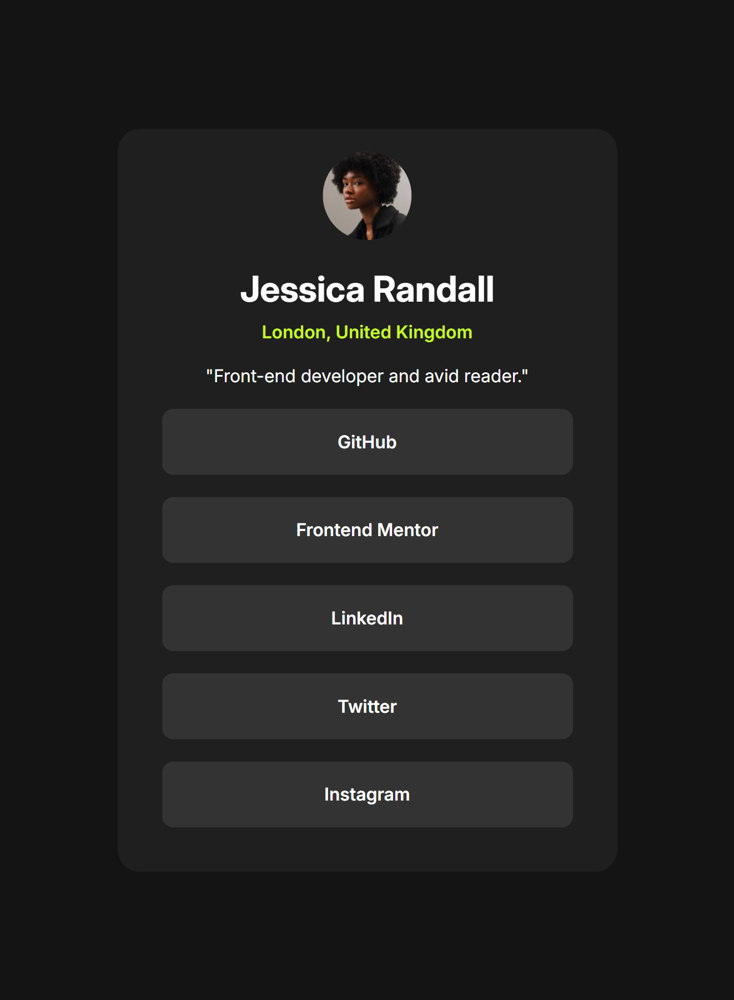

# Frontend Mentor - Social Links Profile Solution

This is a solution to the [Social Links Profile challenge on Frontend Mentor](https://www.frontendmentor.io/challenges/social-links-profile-UG32l9m6dQ).

## Table of contents

- [Overview](#overview)
  - [Screenshot](#screenshot)
  - [Links](#links)
- [My process](#my-process)
  - [Built with](#built-with)
- [Author](#author)
- [Acknowledgments](#acknowledgments)

## Overview

### Screenshot

### Links

- Solution URL: [https://github.com/Yakkarizma/social-links-profile]
- Live Site URL: [https://yakkarizma.github.io/social-links-profile/]

### Built with

- Semantic HTML5 markup
- CSS custom properties
- Flexbox

## Author

- GitHub - [Berke Karabulut](https://github.com/Yakkarizma)
- Frontend Mentor - [@Yakkarizma](https://www.frontendmentor.io/profile/Yakkarizma)

## Acknowledgments

I would like to thank Frontend Mentor for their excellent solutions and for helping me with my development.